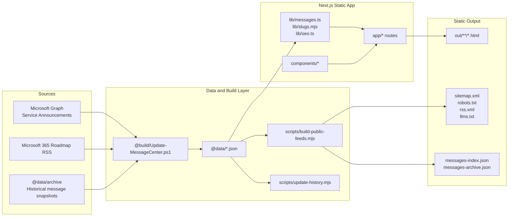
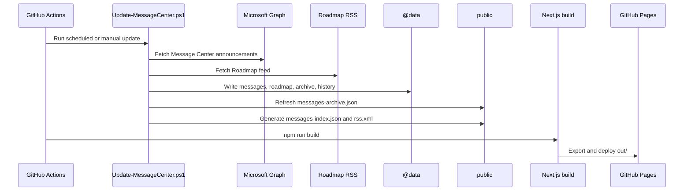
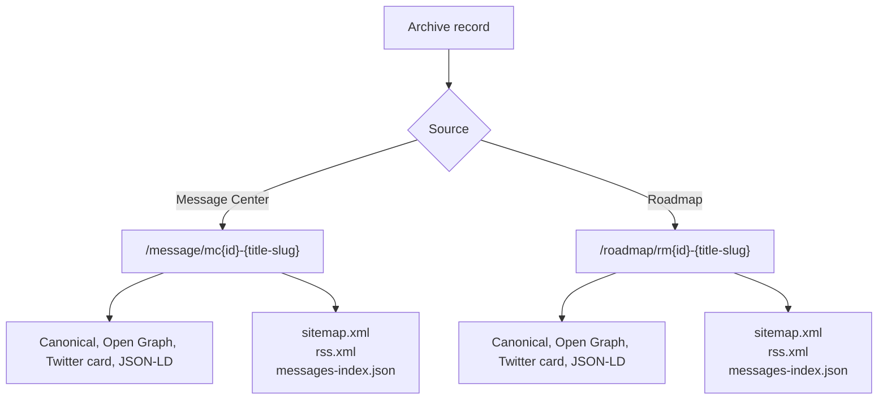
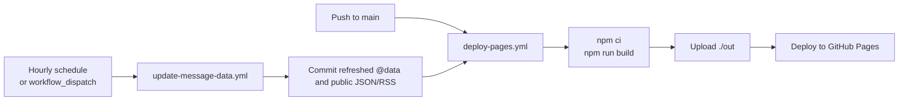

# Microsoft 365 Message Center Archive

Static, searchable Microsoft 365 Message Center and Microsoft 365 Roadmap archive for `message.cengizyilmaz.net`.

This project is designed for GitHub Pages and uses Next.js static export. It imports Microsoft 365 Message Center data through Microsoft Graph, imports Microsoft 365 Roadmap items from the public roadmap feed, generates machine-readable JSON/RSS/SEO files, and publishes a fully static archive.

## Production Targets

- Site: `https://message.cengizyilmaz.net`
- Parent site: `https://cengizyilmaz.net`
- Hosting: GitHub Pages
- Output directory: `out/`
- Canonical Message Center route: `/message/mc{id}-{title-slug}`
- Canonical Roadmap route: `/roadmap/rm{id}-{title-slug}`

## Core Capabilities

- Searchable archive for Microsoft 365 Message Center announcements.
- Separate Microsoft 365 Roadmap archive and detail routes.
- Deterministic canonical URLs for Message Center and Roadmap records.
- Service archive pages.
- Message version history and comparison pages.
- RSS feed, sitemap, robots.txt, llms.txt, and AI-friendly JSON index.
- Static export compatible with GitHub Pages.

## Architecture Overview



## Data Pipeline



## Canonical Routing Model



Message Center and Roadmap routes must not be mixed. Roadmap records are never generated under `/message/`, and Message Center records are never generated under `/roadmap/`.

## Deployment Flow



## Project Structure

```text
.
├── .github/workflows/        # Data update and GitHub Pages deployment
├── @build/                   # Microsoft Graph and Roadmap update scripts
├── @data/                    # Source and generated archive data
│   ├── archive/              # Per-message archived JSON snapshots
│   └── history/              # Version history per message
├── app/                      # Next.js App Router static routes
├── components/               # Layout, table, message, SEO, UI components
├── config/                   # Site-level configuration
├── lib/                      # Data access, filtering, SEO, slug utilities
├── public/                   # Public machine-readable files and OG assets
├── scripts/                  # Feed, reference, and history generators
├── styles/                   # Global CSS and design tokens
└── types/                    # Shared TypeScript types
```

## Technology Stack

- Next.js App Router with static export.
- React and TypeScript.
- Tailwind CSS with local design tokens.
- TanStack Table for large archive browsing.
- GitHub Actions for scheduled data updates and Pages deployment.
- Microsoft Graph PowerShell SDK for Message Center ingestion.

## Public Files

The exported site includes these public machine-readable files:

- `/messages-index.json` - compact canonical index for active, roadmap, and archived records.
- `/messages-archive.json` - archive-only table index.
- `/rss.xml` - latest Message Center and Roadmap feed.
- `/sitemap.xml` - canonical indexable URLs.
- `/robots.txt` - crawler policy and sitemap reference.
- `/llms.txt` - AI/search consumer guidance.
- `/CNAME` - GitHub Pages custom domain configuration.

## Local Development

Install dependencies:

```bash
npm install
```

Run the development server:

```bash
npm run dev
```

Run static validation:

```bash
npm run lint
npm run typecheck
npm run build
```

`npm run build` refreshes public feed files first, then runs `next build --webpack`. Because `next.config.mjs` uses `output: "export"`, production files are written to `out/`.

## Data Updates

For GitHub Actions, create these repository secrets:

- `TENANT_ID`
- `CLIENT_ID`
- `GRAPH_SECRET`

For local data updates, set environment variables or create `@build/config-m365.json` from `@build/config-m365.example.json`. Keep the real config file local and ignored.

```powershell
./@build/Update-MessageCenter.ps1 -GraphSecret "<client-secret>"
```

To refresh only Microsoft 365 Roadmap data:

```powershell
./@build/Update-MessageCenter.ps1 -RoadmapOnly
```

## Security and Data Handling

- Do not commit tenant IDs, client secrets, tokens, `.env` files, or local Graph configuration.
- Keep `@build/config-m365.json` and local secret files out of version control.
- Treat Message Center content as tenant-specific. Always verify tenant applicability in the Microsoft 365 admin center.
- The site is static; no backend runtime or server-side secret access is required.

## GitHub Pages Setup

1. Configure Pages source as GitHub Actions.
2. Add the custom domain `message.cengizyilmaz.net`.
3. Verify the DNS CNAME record points to the GitHub Pages host for the repository.
4. Run `update-message-data` first if fresh Microsoft 365 data is needed.
5. Run `deploy-pages` to publish the static export.
6. Submit `https://message.cengizyilmaz.net/sitemap.xml` in Google Search Console.

## Files Not Intended for Copy or Commit

Do not copy or commit local/generated working directories and private files:

- `node_modules/`
- `.next/`
- `out/`
- `.env*`
- local logs
- local task notes
- `@build/config-m365.json`
- `@build/secrets-m365.json`

### Original Creator
- **Merill Fernando** - [@merill](https://github.com/merill)

### Current Maintainer
- **Cengiz YILMAZ** - [@cengizyilmaz1](https://github.com/cengizyilmaz1)
- [Twitter](https://x.com/cengizyilmaz_) | [LinkedIn](https://linkedin.com/in/cengizyilmazz) | [Blog](https://cengizyilmaz.net) | [Message Center](https://message.cengizyilmaz.net)

## 📝 License

This project maintains the same open-source spirit as the original. Feel free to fork, modify, and share.

## 🔗 Related Resources

- [Microsoft 365 Admin Center](https://admin.microsoft.com)
- [Microsoft 365 Roadmap](https://www.microsoft.com/microsoft-365/roadmap)
- [Microsoft 365 Service Health](https://status.office365.com)
- [Tenant Finder Tool](https://tenant-find.cengizyilmaz.net)

## 💬 Feedback

For feedback, suggestions, or issues:
- Open an [issue](https://github.com/cengizyilmaz1/365MessageCenter/issues)
- Connect on [LinkedIn](https://linkedin.com/in/cengizyilmazz)
- Follow on [Twitter/X](https://x.com/cengizyilmaz_)

---

## License

This project keeps the MIT license notice intact where required.
